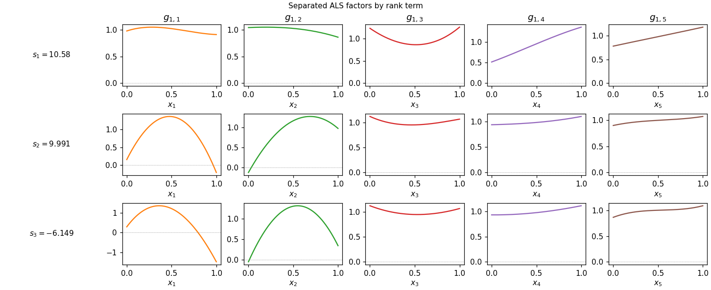
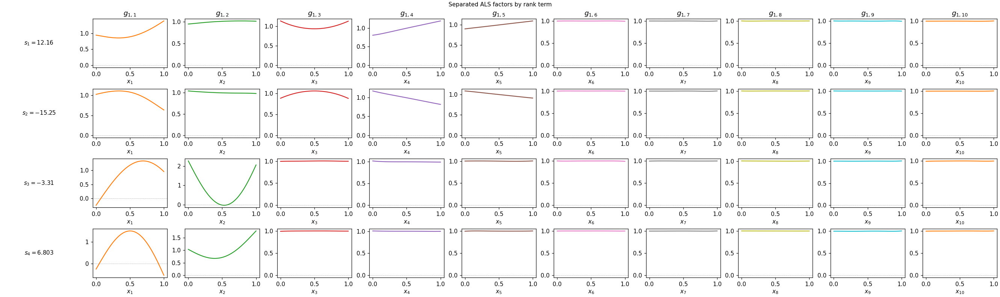
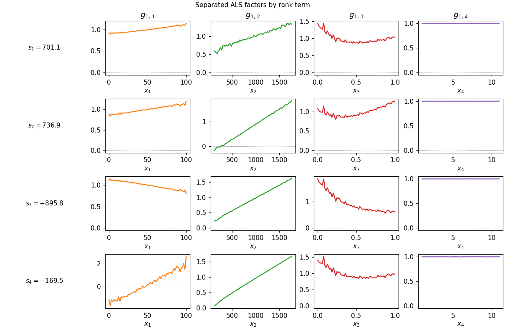
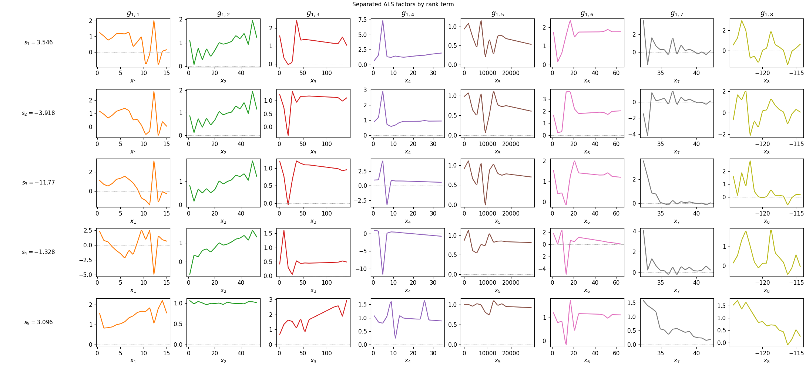

# sepals

Separated ALS regression for scikit-learn, inspired by Beylkin, Garcke, and
Mohlenkamp.

The model has the separated form:

```text
f(x) = intercept + sum_l s_l prod_m g_m^l(x_m)
```

Each one-dimensional factor `g_m^l` is expanded in a basis and fitted with
alternating least squares. Supported bases are:

- `monomial`
- `legendre`
- `tent`

The `tent` basis uses a sparse normal-equation path for larger levels, avoiding
materializing the dense weighted design matrix.

## Attribution

This package implements a Python/scikit-learn style version of the separated
regression algorithm described in:

> Gregory Beylkin, Jochen Garcke, and Martin J. Mohlenkamp.
> "Multivariate Regression and Machine Learning with Sums of Separable
> Functions." SIAM Journal on Scientific Computing, 31(3), 1840-1857, 2009.
> DOI: <https://doi.org/10.1137/070710524>
> PDF: <https://ins.uni-bonn.de/media/public/publication-media/BE-GA-MO2007P.pdf?pk=625>

The separated representation, alternating least-squares fitting strategy,
one-dimensional normal equations, smoothness regularization idea, and multilevel
tent basis are due to Beylkin, Garcke, and Mohlenkamp. This package is an
independent implementation for experimentation and reproduction; it is not
affiliated with or endorsed by the paper authors.

The package license covers only this implementation code and documentation. It
does not relicense the original paper or any third-party datasets, benchmarks,
or text.

Implementation note: this entire codebase was written by GPT-5.5.

BibTeX:

```bibtex
@article{doi:10.1137/070710524,
author = {Beylkin, Gregory and Garcke, Jochen and Mohlenkamp, Martin J.},
title = {Multivariate Regression and Machine Learning with Sums of Separable Functions},
journal = {SIAM Journal on Scientific Computing},
volume = {31},
number = {3},
pages = {1840-1857},
year = {2009},
doi = {10.1137/070710524},
URL = {https://doi.org/10.1137/070710524},
eprint = {https://doi.org/10.1137/070710524}
}
```

## Install

From this directory:

```bash
pip install -e .
```

For tests:

```bash
pip install -e ".[test]"
pytest
```

You can also run tests without installing permanently:

```bash
uv run --with pytest pytest
```

## Quick Start

```python
import numpy as np
from sepals import SeparatedALSRegressor, friedman1, rmse

rng = np.random.default_rng(123)
X_train, y_train = friedman1(2_000, rng, p=10)
X_test, y_test = friedman1(500, rng, p=10)

model = SeparatedALSRegressor(
    rank=4,
    degree=5,
    basis="monomial",
    max_sweeps=40,
    n_init=2,
    random_state=123,
    fit_intercept=True,
)
model.fit(X_train, y_train)

pred = model.predict(X_test)
print("RMSE:", rmse(y_test, pred))
```

## Examples

### Example 1: Friedman #1 (sklearn) and rank-separated factors

Friedman #1 is a standard synthetic regression benchmark: inputs are drawn
uniformly in $[0, 1]^p$, and the response depends on a nonlinear mix of the
first five coordinates (any extra dimensions are noise-only). In scikit-learn’s
`make_friedman1`, the mean function is
$10\sin(\pi x_1 x_2) + 20(x_3 - \frac{1}{2})^2 + 10 x_4 + 5 x_5$ for the
first five coordinates (1-based indices); Gaussian noise is added when
`noise` is positive.

The figure below is produced by `scripts/make_readme_plots.py` (same settings
as `example1_sklearn_friedman1` in that script):

- draws 600 training samples with `n_features=5`, `noise=0.1`, and
  `random_state=0`;
- fits `SeparatedALSRegressor(rank=3, degree=3, max_sweeps=20, random_state=0)`
  (other hyperparameters left at package defaults: Legendre basis,
  `ridge=1e-8`, `n_init=3`, `tol=1e-7`, `fit_intercept=False`,
  `kernel_backend="optimized"`);
- calls `plot_separation_stages` with `n_grid=150` and writes
  `docs/images/friedman1_sklearn_separation_stages.png`.

Regenerate all example figures:

```bash
uv run --extra plot python scripts/make_readme_plots.py
```

<p align="center">
  
</p>

### Example 2: Friedman #1 with more features (package helper)

The Quick Start block above uses the package helper `friedman1`, which
implements the same mean function on uniform $[0,1]^p$ inputs (optional
Gaussian noise via `noise_std`; that block leaves the default
`noise_std=0.0`). There, `p=10`, `2_000` training and `500` test rows,
`rank=4`, `degree=5`, `basis="monomial"`, `max_sweeps=40`, `n_init=2`,
`random_state=123`, and `fit_intercept=True`. The separation plot below fits on
the `2_000` training rows only and is saved as
`docs/images/friedman1_p10_separation_stages.png`.

<p align="center">
  
</p>

### Example 3: Friedman #2 and the tent basis

Friedman #2 is a second classic benchmark: four inputs on different scales
with a strongly nonlinear interaction; the package helper is `friedman2`.
The Tent Basis Example section below fits `SeparatedALSRegressor` with
`basis="tent"` on `5_000` samples, `rank=4`, `degree=6`,
`smoothness=1e-6`, `penalty_kind="tent_level"`, `max_sweeps=20`, and
`random_state=123`. The figure is `docs/images/friedman2_tent_separation_stages.png`.

<p align="center">
  
</p>

### Example 4: California housing (tent, tuned hyperparameters)

[California housing](https://scikit-learn.org/stable/datasets/real_world.html#california-housing-dataset)
(eight numeric predictors, median house value as target). The script trains on
a random subset of 6,000 rows (`random_state=42`) for speed, using hyperparameters
from an MPF2 interpretable search (`sepals_rank_le_2_ctr23`): `rank=1`,
`degree=4`, `basis="tent"`, `ridge=0.007168023918105929`,
`smoothness=7.218538035064866e-08`, `max_sweeps=100`, `tol=4.952524696642217e-06`,
`n_init=3`, `refit_scales=True`, `fit_intercept=False`, `penalty_kind="tent_level"`,
`random_state=0`. Output: `docs/images/california_housing_separation_stages.png`.

<p align="center">
  
</p>

## Scikit-Learn Usage

`SeparatedALSRegressor` follows the scikit-learn estimator API. It supports
`get_params`, `set_params`, `score`, `Pipeline`, `GridSearchCV`, and
`sklearn.base.clone`.

```python
import numpy as np
from sklearn.model_selection import GridSearchCV
from sklearn.pipeline import Pipeline
from sklearn.preprocessing import StandardScaler

from sepals import SeparatedALSRegressor, friedman1

rng = np.random.default_rng(123)
X, y = friedman1(300, rng, p=6)

pipe = Pipeline([
    ("scale", StandardScaler()),
    ("als", SeparatedALSRegressor(
        basis="legendre",
        max_sweeps=8,
        n_init=1,
        random_state=123,
        fit_intercept=True,
    )),
])

search = GridSearchCV(
    pipe,
    {
        "als__rank": [1, 2],
        "als__degree": [2, 3],
    },
    cv=3,
)
search.fit(X, y)
print(search.best_params_)
print(search.score(X, y))
```

## Tent Basis Example

```python
import numpy as np
from sepals import SeparatedALSRegressor, friedman2

rng = np.random.default_rng(123)
X, y = friedman2(5_000, rng)

model = SeparatedALSRegressor(
    rank=4,
    degree=6,
    basis="tent",
    smoothness=1e-6,
    penalty_kind="tent_level",
    max_sweeps=20,
    random_state=123,
)
model.fit(X, y)
```

## API

### `SeparatedALSRegressor`

Main estimator.

Important parameters:

- `rank`: number of separated rank terms.
- `degree`: polynomial degree, or tent level for `basis="tent"`.
- `basis`: one of `"monomial"`, `"legendre"`, or `"tent"`.
- `ridge`: small diagonal regularization.
- `smoothness`: basis coefficient smoothness penalty.
- `penalty_kind`: `"degree"`, `"degree2"`, or `"tent_level"`.
- `max_sweeps`: maximum ALS sweeps per random initialization.
- `tol`: relative training-loss stopping tolerance.
- `n_init`: number of random initializations.
- `fit_intercept`: whether to subtract/add a mean intercept.
- `kernel_backend`: `"optimized"` by default, `"reference"` to force the
  original NumPy kernels for parity checks, or `"mps"` to run dense ALS fitting
  on Apple Silicon through PyTorch's Metal backend.

Methods:

- `fit(X, y, X_val=None, y_val=None)`
- `predict(X)`
- `factor_values(feature, grid)`

### Dataset Helpers

- `friedman1(n, rng, noise_std=0.0, p=10)`
- `friedman2(n, rng, noise_std=0.0)`
- `rmse(y, yhat)`

## Notes

The default install keeps the implementation NumPy-only. Hot ALS kernels live in
a private module with reference and optimized variants. Dense ALS fits can also
use Apple Silicon through `kernel_backend="mps"` after installing the optional
PyTorch dependency:

```bash
pip install "sepals[mps]"
```

The MPS backend currently uses float32 tensors and supports dense ALS paths
(`"legendre"`, `"monomial"`, and low-level `"tent"` before sparse tent assembly
is selected). It is intended for larger dense fits where GPU launch overhead can
be amortized; small fits usually remain faster on the optimized NumPy path.
High-level sparse tent fitting remains on the optimized CPU path. The biggest
remaining cost is the repeated ALS fitting across hyperparameter grids. For
large grid searches, parallelize at the experiment level.
